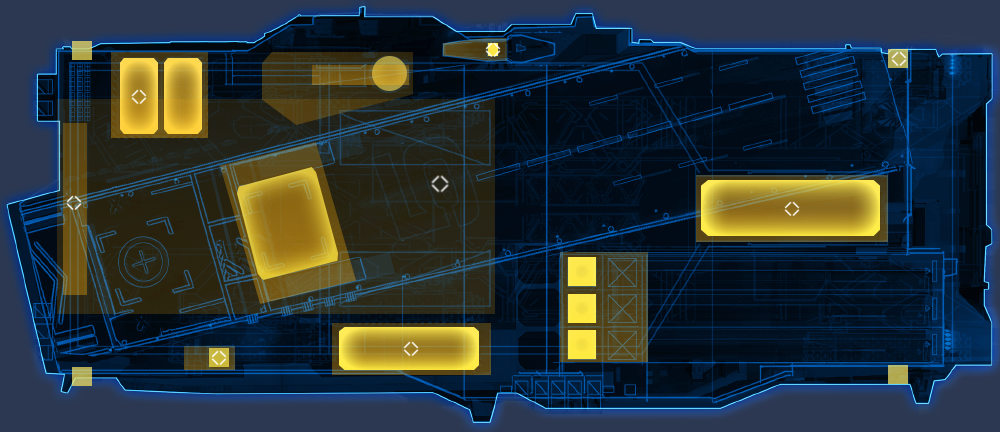

# 斯叶特 DVC-66 型 陆地航空母舰

继承于科研机动平台的设计思路，能在恶劣环境中保持全系统运行；

作为近前沿支点的进攻型重型陆地机动平台，能快速进行前线部署

拥有足够长的飞行甲板与充足的电磁弹射器，能在短时间内清空飞行甲板

具备生产**巡洋舰级以下单位**的能力

**长:宽:高 = 520：380：194**

**空载质量：620,000t**

**满载质量：940,000t**

# 动力

## 能源系统

### 主动力 - 暗物质反应堆/零点反应堆

### 备用动力 - 反物质反应堆 + 冷核聚变反应堆

### 多倍冗余电容器能量管理与分配系统

## 航行系统
极限航速：85km/h≈45.90kn  
经济航速：45km/h≈24.30kn

### 行进系统
重型履带式行进系统  
布局：  
■    ■  
   ■   
■    ■  

# 容量

## 载员
设计载员：5K  
正常载员：4.5K  
极限载员：15K

## 机库
长:宽:高 = 320：220：40  
可容纳256架重型战机（转换比 重：中：轻：大=1:1.5:2:3）  
正常载机数：大型 26 重型 66 中型 32 轻型 32

## 车库
长:宽:高 = 240：200：40  

# 武备

## 防御

### 结构

#### 复合工程陶瓷-工程钢板材

#### 流体式自恢复结构组件

### 自适应自修复纳米复合装甲
主装甲带 倾斜 45° 铺设 800mm 复合装甲  
次装甲带 倾斜 25°-12° 铺设 600-400mm 复合装甲   
核心区 1800mm 复合装甲   

### 自适应立场护盾
覆盖范围：全舰  
区域支持：是  

#### 辅助护盾回充增量器

使用额外的电容注电器装料，来快速恢复护盾强度。

#### 护盾回充增量器

消耗能量以快速恢复护盾强度。

### 自适应快速损伤控制系统

## 武器

### 点防御-近程防御武器系统

#### DFJ-1000 C 型 标枪 PDS-CIWS ×16

####  DFJ-2000 B 型 守门员 CIWS ×18

#### DFJ-3000 A 型 棘刺 PDS x12

#### DFJ-4000 A 型 灰烬 PDS ×12

### 火炮集群

#### OTPE-10 A 型 108mm 单管磁轨炮 ×8

### 导弹发射器

#### DMT-08 B 型 中型导弹倾斜式发射系统 x8

### 传感矩阵

#### FSS-96 K 型 复合型 传感/火控系统

#### FSS-66 C 型 复合型 全方位传感系统

#### FSS-66 E 型 复合型 电子对抗系统

# 制造

制造系统是全舰的核心，该系统保证了舰队在远洋，作战时的后勤  

### 超时空量子网络 / Hyper-spacetime Quantum networks

### 「灰蛊」— 活性金属纳米机器人集群

### 3H3D Printing / 高速高精度高强度3D打印系统

# 自适应人工生态系统

自持力：  
设计载员：人工生态系统最佳容纳值 4-8年后大修  
极限载员：人工生态系统将于60日后需要大修 180日后彻底崩溃  

# 舰队指挥系统

由**战略信息中心/SIC**与**作战情报中心/CIC**组成，两者可互相转换，整合

## 战略信息中心:SIC/Strategic Information Center

**战略指挥中心**：命令中心，该中心负责提供战略/战术目标；战略支援管理部门  
结构：三贤人逻辑计算系统，舰长及副舰长，大副，舰队参谋部  
特殊性：舰队的“大脑”，战略支援管理部门，第二战术指挥中心；无执行权限，拥有间接命令权限，总部战术/战略命令:执行，建议，否决权  

## 作战情报中心:CIC/Combat Information Center

**战术指挥中心**：命令/执行中心，该中心负责提供战术/战略目标，有执行与直接命令权限；战术支援管理部门  
结构：战术计算系统，舰队指挥部门，舰队参谋部  
特殊性：舰队的“小脑与脊髓”，战术支援管理部门，第二战略指挥中心；拥有执行权限，直接命令权限，SIC战术/战略命令:执行，建议，否决权  

##  C4ISR统一数据链路

