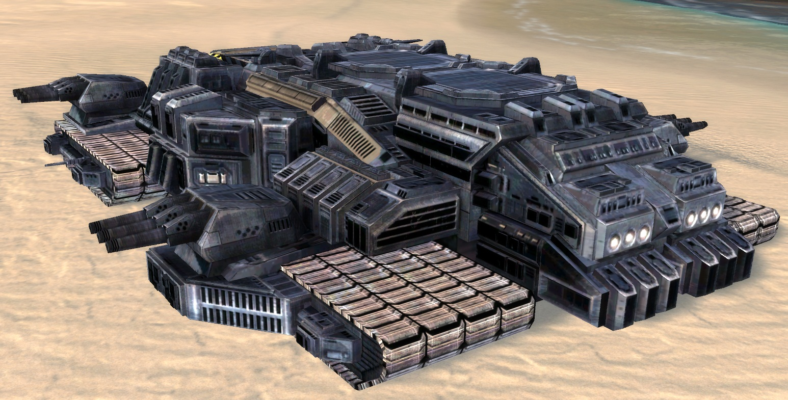

# 胖墩 DMF-45 型 机动工厂

**DMF-45 型 机动工厂**与**DVCH-33 型 运载舰**是两个交叉职能的超重型陆地机动平台，**DMF-45 型 机动工厂**主要负责后勤与战略支持方面；

**DMF-45 型 机动工厂**能在资源充足的情况下快速生产**重型平台以下的各级陆地 / 空中单位**，代价就是庞大的工业模块迫使**DMF-45 型 机动工厂**没有过多的空间来设置充足的机 / 车库。

**长:宽:高=1500：660：350**

**空载质量：68,000,000t**

**满载质量：100,000,000t**

# 动力

## 能源系统

### 主动力 - 暗物质反应堆/零点反应堆

### 备用动力 - 反物质反应堆 + 冷核聚变反应堆

### 多倍冗余电容器能量管理与分配系统

## 航行系统

极限航速：60km/h≈32.40kn  
经济航速：30km/h≈16.20kn

### 行进系统

多重重型履带式行进系统  
布局：  
■ ■ ■ ■  
 ■ ■ ■  
■ ■ ■ ■

# 容量

## 载员

设计载员：50K  
正常载员：30K  
极限载员：120K

## 储存库

### 车库

长:宽:高=600：300：80

### 机库

长:宽:高=600：300：40

# 武备

## 防御

### 结构

#### 复合工程陶瓷-工程钢板材

#### 流体式自恢复结构组件

### 自适应自修复纳米复合装甲

主装甲带 倾斜 45° 铺设 1800mm 复合装甲  
次装甲带 倾斜 25°-12° 铺设 1200-600mm 复合装甲  
核心区 2600mm 复合装甲

### 自适应立场护盾

覆盖范围：全舰  
区域支持：否

#### 辅助护盾回充增量器

使用额外的电容注电器装料，来快速恢复护盾强度。

#### 护盾回充增量器

消耗能量以快速恢复护盾强度。

### 自适应快速损伤控制系统

## 武备

### 点防御-近程防御武器系统

#### DFJ-1000 C 型 标枪 PDS-CIWS ×64

#### DFJ-2000 B 型 守门员 CIWS ×24

#### DFJ-3000 A 型 棘刺 PDS x36

#### DFJ-4000 A 型 灰烬 PDS ×26

### 火炮集群

#### OTPE-10 A 型 108mm 单管磁轨炮 ×24

#### OTPE-13 A 型 130mm 单管磁轨炮 ×18

#### OTPE-36 B 型 368mm 双管磁轨炮 ×6

### 导弹发射器

#### DRT-30 B 型 中型火箭倾斜式发射系统 ×8

#### DMV-128 C 型 大型导弹垂直式方型发射系统 ×1

### 传感矩阵

#### FSS-96 U 型 复合型 传感/火控系统

#### FSS-96 C 型 复合型 全方位传感系统

#### FSS-96 E 型 复合型 电子对抗系统

# 制造

制造系统是全舰的核心，该系统保证了舰队在远洋，作战时的后勤

### 超时空量子网络 / Hyper-spacetime Quantum networks

### 「灰蛊」— 活性金属纳米机器人集群

### 3H3D Printing / 高速高精度高强度 3D 打印系统

大型船坞 2

船坞 24

生产线 64

# 自适应人工生态系统

自持力：  
设计载员：人工生态系统最佳容纳值 4-8 年后大修  
极限载员：人工生态系统将于 60 日后需要大修 180 日后彻底崩溃

# 舰队指挥系统

由**战略信息中心/SIC**与**作战情报中心/CIC**组成，两者可互相转换，整合

## 战略信息中心:SIC/Strategic Information Center

**战略指挥中心**：命令中心，该中心负责提供战略/战术目标；战略支援管理部门  
结构：三贤人逻辑计算系统，舰长及副舰长，大副，舰队参谋部  
特殊性：舰队的“大脑”，战略支援管理部门，第二战术指挥中心；无执行权限，拥有间接命令权限，总部战术/战略命令:执行，建议，否决权

## 作战情报中心:CIC/Combat Information Center

**战术指挥中心**：命令/执行中心，该中心负责提供战术/战略目标，有执行与直接命令权限；战术支援管理部门  
结构：战术计算系统，舰队指挥部门，舰队参谋部  
特殊性：舰队的“小脑与脊髓”，战术支援管理部门，第二战略指挥中心；拥有执行权限，直接命令权限，SIC 战术/战略命令:执行，建议，否决权

## C4ISR 统一数据链路
