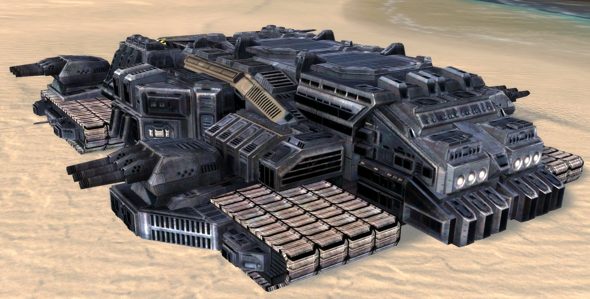

# 胖小子 / 胖墩Ⅱ型 DBB-22型 陆地战列舰

作为**DMF-45型 机动工厂**的改进型重型陆地机动平台，胖墩Ⅱ型具有厚重的装甲与之对应的庞大身躯和火力；胖墩Ⅱ型是陆地舰队的中坚力量，胖墩Ⅱ型能通过自身火力来扫除陆地舰队前进的障碍；作为胖墩Ⅰ型改进型胖墩Ⅱ型可以在资源充足的情况下生产**巡洋舰级以下单位**。

**长:宽:高=430：360：154**

**空载质量：670000t**

**满载质量：980000t**

# 动力

## 能源系统

### 主动力
**超时空量子网络能量传输链路**  
由总部的超时空量子网络核心，统一对外派的单位进行跨世界能量传输

### 备用动力
四套功率为3600MW重物质反应炉（总功率1440000MW，燃料消耗：14T质量×4/14天）

### 二级备用动力
四套功率为1200MW冷聚变反应炉（总功率4800MW，燃料消耗：28T级DT[氘氚]固体燃料棒×4/32个月）  
备用的电容能量分配系统可将19200MW的能量储存并分配到全舰各处（四倍标准冗余）

## 航行系统
极限航速：85km/h≈46nmi/h（/kn）  
高速航速：80km/h≈43nmi/h（/kn）  
常规航速：50km/h≈27nmi/h（/kn）  
经济航速：30km/h≈16nmi/h（/kn）

### 行进系统
二行进模式：陆面，水下

#### 陆面/水下行进模式
重型履带式行进系统  
布局：2×2（外置）  

# 容量

## 载员
设计载员：3K（人工生态系统最佳容纳值 6-12年后大修）  
正常载员：0.5K（因全舰可由AI驾驶，因此可将人员精简至最小值）  
极限载员：6K（人工生态系统极限容纳值 24日后大修 38日后崩溃）

## 车/机库
长:宽:高=260：180：50  
即：2340000m³/46800㎡×50

# 武备

## 防御
**全装甲设计**

### 蜂窝式结构
五边形的蜂窝式结构能有效缓冲动能传播，能有效保护船舱内的人员与设备（动能抗性修正 +50%；爆炸抗性修正 +30%）

#### 材料
使用了"灰蛊"作为主要材料，部分特种材料由量子系统生产与维护

### 装甲
装甲 1200mm 复合装甲  
外壳填充层 360mm 设备层  
核心区 860mm B4K5型复合装甲  

### 护盾
**重型穹顶型自适应立场护盾**  
由于复合式立场发生管理系统的革新，使在大气内地面单位可以装备立场护盾。  
覆盖范围：长:宽:高=560：480：300  
规模/护盾值：3600MW-5760000MW  
能量消耗：3600MW/H - 5760000MW/H
恢复效率：1200MW/H - 1920000MW/H

### 损伤控制系统
由量子+灰蛊复合协作系统组成的复合损管系统（全抗性修正 +50%）

## 武器

### DFJ-2000B型 炮弹一体近防系统 ×16
**类型：点防御-质量/离子**  
组成：转动式底盘，自动装填系统

DQS-03W型 30mm六管加特林机枪  
类型：混合炮

DQS-08N型 88mm双管混合炮  
类型：混合炮

DDS-02P型 小型导弹倾斜式发射系统  
类型：导弹发射系统  
组成：四联装外露式发射器，集成式四通道火控雷达  
特殊性：仅小型导弹（200mm×2200mm以下），四联装，热发射模式，近程传感系统（理论有效距离：50KM）

FSS-08L型 复合型传感/火控系统  
类型：传感/火控系统  
组成：光学+辐射（激光，红外线，X光，微波，盖茨计数器）+波动（震动，声纳/声波）+粒子（中微子，引力子）+生物传感器  
特殊性：  
近程传感系统（理论有效距离：80KM），多通道（64火控+128传感通道），系统可独立运行，高精度光学辅助观瞄系统

### DFJ-1000C型 炮弹一体近防系统 ×24
**类型：点防御-质量/离子**  
组成：转动式底盘，自动装填系统

DQS-01K型 15mm六管加特林机枪  
类型：混合炮

DQS-06D型 66mm双管混合炮  
类型：混合炮

DDS-02F型 小型导弹倾斜式发射系统  
类型：导弹发射系统  
组成：二联装外露式发射器，集成式二通道火控雷达  
特殊性：仅小型导弹（200mm×2200mm以下），二联装，热发射模式，近程传感系统（理论有效距离：50KM）

FSS-08L型 复合型传感/火控系统  
类型：传感/火控系统  
组成：光学+辐射（激光，红外线，X光，微波，盖茨计数器）+波动（震动，声纳/声波）+粒子（中微子，引力子）+生物传感器  
特殊性：  
近程传感系统（理论有效距离：80KM），多通道（64火控+128传感通道），系统可独立运行，高精度光学辅助观瞄系统

### DFD-02型 28MW级激光武器系统 ×12
**类型：点防御-激光**  
特殊性：120MW级电容（自持：1min，蓄能：12.5s）

### DQS-08N型 88mm双管混合炮 ×24
**类型：混合炮**

### DQS-13H型 130mm双管混合炮 ×12
**类型：混合炮**

### DQS-26R型 268mm三管混合炮 ×8
**类型：混合炮**

### DQS-88I型 880mm三管混合炮 ×4
**类型：混合炮**

### DDS-30H型 中型导弹倾斜式发射系统 ×6
**类型：导弹发射系统**  
组成：八联装密封式发射器，自动装填系统，可转动机械臂，集成式十通道火控雷达  
特殊性：中型导弹（200mm-600mm×2200mm-6600mm），八联装，热发射模式，中程传感系统（理论有效距离：500KM）

### DDS-43E型 导弹垂直式方型发射系统 ×1
**类型：导弹发射系统**  
组成：二百五十六联装垂直式发射器，自动装填系统  
特殊性：小-大型导弹（200mm×2200mm以下/200mm-600mm×2200mm-6600mm以下/600mm-1200mm×6600mm-8800mm），一百二十八联装，冷（电磁/气体）/热发射模式

### FSS-45K型 复合型传感/火控系统
**类型：传感/火控系统**  
组成：光学+辐射（激光，红外线，X光，微波，盖茨计数器）+波动（震动，声纳/声波）+粒子（中微子，引力子）+生物传感器  
特殊性：  
远程传感系统（理论有效距离：800KM），多通道（128火控+256传感通道），高精度光学辅助观瞄系统，**与舰队指挥系统集成**

### FSS-66L型 复合型传感/火控系统
**类型：传感/火控系统**  
组成：光学+辐射（激光，红外线，X光，微波，盖茨计数器）+波动（震动，声纳/声波）+粒子（中微子，引力子）+生物传感器  
特殊性：  
远程传感系统（理论有效距离：1200KM），多通道（256火控+512传感通道），高精度光学辅助观瞄系统，**与舰队指挥系统集成**

### FSS-96F型 复合型传感/火控系统
**类型：传感/火控系统**  
组成：光学+辐射（激光，红外线，X光，微波，盖茨计数器）+波动（震动，声纳/声波）+粒子（中微子，引力子）+生物传感器  
特殊性：  
长程传感系统（理论有效距离：2200KM），多通道（512火控+1024传感通道），高精度光学辅助观瞄系统，**与舰队指挥系统集成**

# 子系统

## 工业
工业系统是全舰的核心，该系统保证了舰队在远洋，作战时的后勤

### SC-1080it 量子系统
量子系统是整个OU的基石之一  
组成：大型超时空量子网络+多用途量子工程系统

#### 超时空量子网络
组成：小型化超时空模块+量子网络

#### 多用途量子工程系统
将超时空量子网络内的质能通过量子发生与回收装置将目标产物完全打印，反之既然  
类型：量子打印与回收装置  
功能：生产，修复，回收  
特殊性：需要"打印头"

##### 多用途超时空量子质能打印与回收工具 ———— "打印头"
多用途量子工程系统的重要组成部分，"打印头"拥有多种形态与各类改进型。

### 灰蛊系统
**工业系统第二序列**  
类型：多用途纳米机器人集群  
功能：修复，维护，回收，生产  
特殊性：主要使用点：全舰

#### 快速整备系统
这是一个特殊的系统，该系统能保证舰队高强度作战时的快速恢复，但该系统与**多用途量子工程系统**职能冲突，并且该系统的整备效率与**多用途量子工程系统**持平，因此很多人认为**快速整备系统**是**多用途量子工程系统**的分支，但是该系统其实是灰蛊系统的分子。  
类型：**灰蛊系统**分支  
功能：修复，维护，回收，生产  
特殊性：主要使用点：全舰/远程协助

### 资源系统

#### 资源管理系统
由SC-1080it 量子系统与灰蛊系统组成的复合检查管理系统

#### 能量-质能转换系统
高级能量-质能转换技术，通过量子系统与能量来将微观粒子直接合成为元素
具体技术标准【■■权限不足，无法查询■■】  

## 舰队指挥系统
由**战略信息中心/SIC**与**作战情报中心/CIC**组成，两者可互相转换，整合

### 战略信息中心:SIC/Strategic Information Center
**战略指挥中心**：命令中心，该中心负责提供战略/战术目标；战略支援管理部门  
结构：三贤人逻辑计算系统，舰长及副舰长，大副，战略参谋部  
特殊性：舰队的“大脑”，战略支援管理部门，第二战术指挥中心；无执行权限，拥有间接命令权限，总部战术/战略命令:执行，建议，否决权

### 作战情报中心:CIC/Combat Information Center
**战术指挥中心**：命令/执行中心，该中心负责提供战术战略目标，有执行与直接命令权限；战术支援管理部门  
结构：战术计算系统，舰队指挥部门，战术参谋部  
特殊性：舰队的“小脑与脊髓”，战术支援管理部门，第二战略指挥中心；拥有执行权限，直接命令权限，指挥信息中心战术/战略命令:执行，建议，否决权

### 舰载一体化火控/传感系统
将全舰传感资源整合至CIC，并可通过全军数据链共享。

### 全军联合分布式计算链路
通过数据链与各单位进行连接，在核心单位的统一分配下进行分布式计算

## 舰载生态系统
系统性工程，通过各级这些天来对本舰的生态区进行调控

### 人工生态系统
人工生态区，能缓解舰员的神经压力，并且提供新鲜的蔬果

#### 人工生态循环
循环利用由载员与舰载生物代谢产生的物质。

#### 微机械生物循环系统
人工生态系统的基础，作为最底层的物质循环系统；为了保护人工生态系统，该系统已被物理写死。
